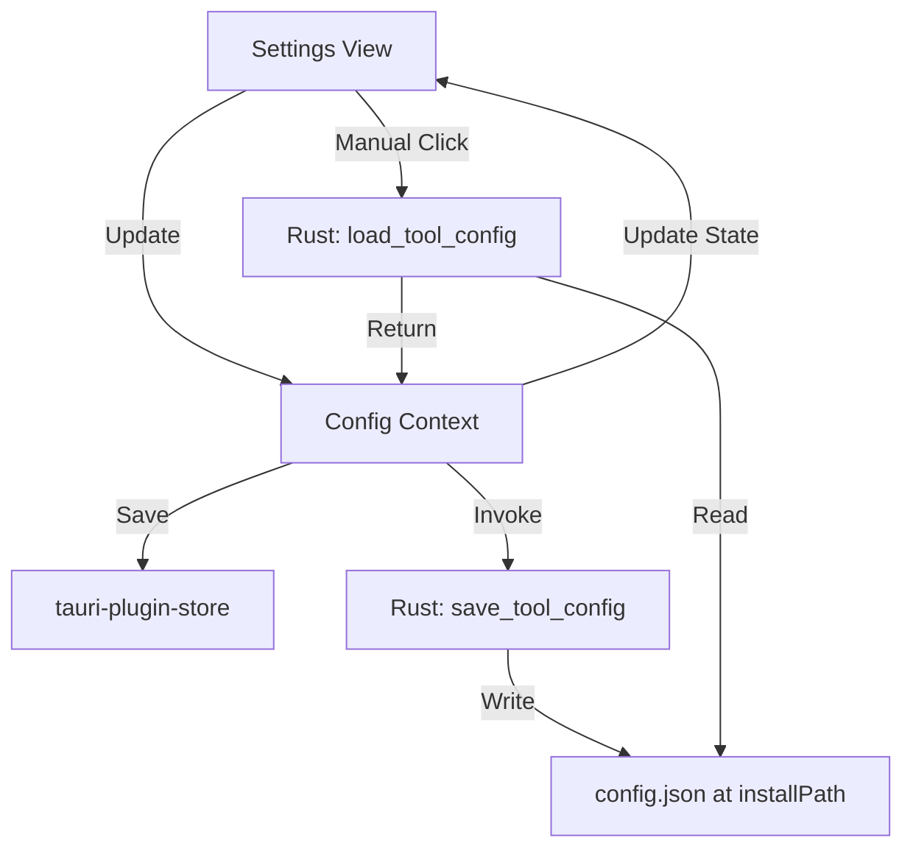

# Configuration Editing

The savegame parser package uses a JSON-based configuration. It is located
here:

`{INSTALL_PATH}/config.json`

> NOTE: {INSTALL_PATH} is where the savegame parser package has been installed
> (as set in the app's settings).

## JSON Structure

```json
{
  "gameFolder": "C:\\Users\\Someone\\Documents\\Egosoft\\X4\\11111111",
  "storageFolder": "archived-saves",
  "viewerHost": "localhost",
  "viewerPort": 9494,
  "autoBackupEnabled": true,
  "keepXMLFiles": false,
  "loggingEnabled": false
}
```

## Implementation Plan

### 1. Adding Necessary Settings

All settings from the configuration must be available in the app's settings
tab. Here are explanations of the settings:

- `gameFolder` (string): Path to X4 documents folder (Already implemented as the savegame folder)
- `storageFolder` (string): Path to store extracted data, relative to `gameFolder`
- `viewerHost` (string): Hostname for UI server (Already implemented)
- `viewerPort` (int): Port for UI server (Already implemented)
- `autoBackupEnabled` (bool): Enable auto backups
- `keepXMLFiles` (bool): Keep extracted XML files
- `loggingEnabled` (bool): Enable verbose viewer logging

### 2. Generating The Config

Whenever the user modifies settings, the JSON configuration file in the savegame
parser folder must be updated (and created as necessary if it does not exist).
Provided that the folder has been set and is valid, of course. Otherwise, a warning
should be displayed in the UI.

## Mermaid Flow


## Work Packages

### WP1: Backend Commands & Data Models
- **Goal**: Establish the communication bridge for file operations.
- [x] Define `ToolConfig` struct in Rust to match the PHP tool's JSON structure.
- [x] Implement `save_tool_config(config: ToolConfig, install_path: PathBuf)` command.
- [x] Implement `load_tool_config(install_path: PathBuf)` command.
- [x] Register commands in `src-tauri/src/lib.rs`.

### WP2: Frontend State & i18n
- **Goal**: Update the application state to support new settings.
- [x] Expand `AppConfig` interface in `src/context/ConfigContext.tsx` with:
    - `storageFolder`, `autoBackupEnabled`, `keepXMLFiles`, `loggingEnabled`.
- [x] Update `DEFAULT_CONFIG` with defaults from this document.
- [x] Add translation keys to `src/locales/en.json`, `de.json`, and `fr.json`.

### WP3: Config Sync Logic
- **Goal**: Automate saving and enable manual loading.
- [x] Update `updateConfig` in `ConfigContext.tsx` to detect changes in tool settings and invoke `save_tool_config`.
- [x] Add `loadFromToolConfig()` to `ConfigContext.tsx` to fetch and apply settings via `load_tool_config`.
- [x] Implement error handling for the IPC calls (showing errors via `ErrorContext`).

### WP4: UI Implementation
- **Goal**: Expose settings and controls to the user.
- [x] Update `SettingsView.tsx` with a new "Savegame Parser Tool" section.
- [x] Add form fields for new settings (Path input for `storageFolder`, Toggles for booleans).
- [x] Add "Import from config.json" button with loading state.
- [x] Ensure the UI reacts to the "config write failed" warning banner.

