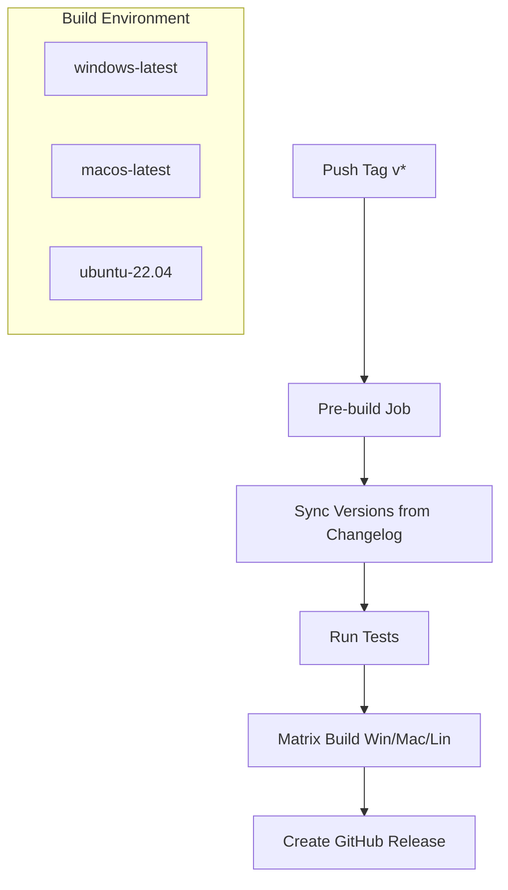

# Release Automation & Testing Plan

This project aims to automate the multi-platform release process for the X4 Savegame Monitor & Launcher using GitHub Actions, while ensuring code quality through a comprehensive testing suite.

## Overview
We will use the official `tauri-apps/tauri-action` to handle the complexities of cross-platform builds, including installing system dependencies for Linux and bundling the application into installers for Windows, macOS, and Linux.

## Work Packages

### [WP1: Testing Infrastructure](5-release-automation/wp1-testing-infrastructure.md)
- Set up Vitest for frontend unit and component testing.
- Set up Cargo for backend Rust testing.
- Create initial tests for existing code.

### [WP2: Project Preparation & Versioning](5-release-automation/wp2-project-prep.md)
- Rename `changelog,md` to `changelog.md`.
- Establish `changelog.md` as the source of truth for versions and release notes.
- Define the versioning synchronization strategy.

### [WP3: GitHub Actions Release Workflow](5-release-automation/wp3-github-action.md)
- Create `.github/workflows/release.yml`.
- Implement automated version extraction and manifest syncing.
- Implement multi-platform matrix builds (Windows, macOS, Linux).
- Configure automated GitHub Release creation with formatted notes.

## Technical Strategy

### Key Technologies
- **GitHub Actions**: Pipeline orchestration.
- **Tauri Action**: Official action for building Tauri apps.
- **Vitest**: Frontend testing framework.
- **Rust/Cargo**: Backend testing and building.
- **Unsigned Binaries**: The initial release will be unsigned (Windows SmartScreen/macOS Gatekeeper warnings).
