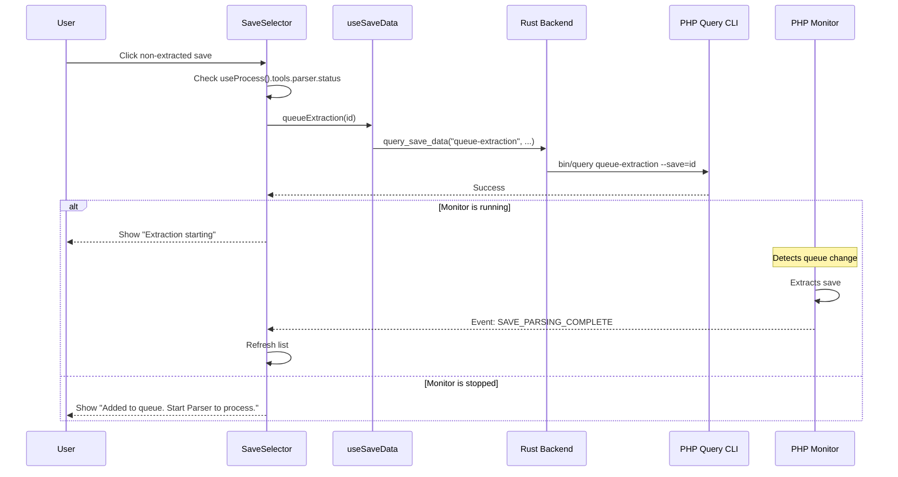

# Plan: Save Extraction Management

This plan covers the integration of the `queue-extraction` CLI command and real-time synchronization between the save list and the monitor's progress.

## 1. Logic Requirements

- **Extraction Trigger**: Clicking a save marked as `isUnpacked: false` should attempt to queue it for extraction.
- **Persistence**: Since the extraction queue is persistent, users can add saves even if the Monitor is offline.
- **Feedback**:
  - If monitor is running: Call `queue-extraction --save=<id>` and show "Extraction will start shortly".
  - If monitor is NOT running: Call `queue-extraction --save=<id>` but show a hint that the "Parser must be started to process the queue".
- **Sync**: The save list should automatically refresh when the monitor finishes parsing a save.

## 2. Component Updates

### `useSaveData` Hook
- [x] Add `queueExtraction(saveId)` method.
- [x] Add `getQueue()` method to check current status.

### `SaveSelector` Component
- [x] Integrate `useProcess` hook to monitor `parser` status.
- [x] Implement `handleSaveClick` with branching logic (select vs. queue).
- [x] Add an effect that listens to `tools.parser.currentEvent`.
  - Refresh the list when event is `SAVE_PARSING_COMPLETE`.
- [x] Update `SaveItem` to display a "Ready to Extract" state.

### `SaveDataViewer` Component
- [x] Display a warning banner if the selected save is not yet extracted and the monitor is offline.

### Notification System (New)
- [x] Create a `NotificationContext` to manage non-error alerts.
- [x] Implement a `Toast` component for success/info messages.
- [x] Trigger a success toast when a save is successfully extracted.

## 3. UI/UX Enhancements

- **Empty State**: Improve the placeholder when no save is selected.
- **Loading States**: Add a spinner or progress bar when a save is being extracted.
- **Error Handling**: Standardize how CLI errors (e.g. "Save not found") are displayed during extraction queueing.

## 4. Sequence Diagram

