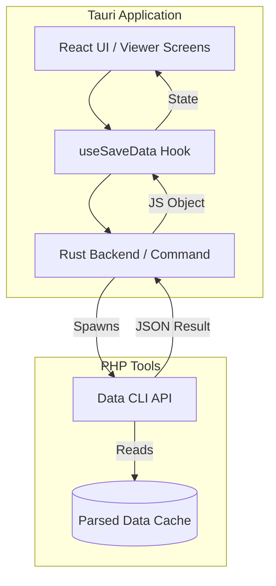

# Plan: CLI JSON API Implementation & Viewer Integration

This plan outlines the architectural approach for replacing the standalone PHP Viewer with integrated screens in the Tauri/React application, powered by a new CLI JSON API.

## 1. CLI JSON API Specification

The API will be a PHP script called by the Tauri backend to retrieve specific datasets from the parsed savegame.

### Filtering Strategy (Response to user query)
- **API-side Filtering (Mandatory)**: For large collections like `ships`, `stations`, and `logbook`.
  - Arguments: `--faction`, `--type`, `--search`, `--limit`, `--offset`.
- **Client-side Filtering (Optional)**: For small metadata like `factions`, `sectors`, or `equipment_types`.

### Example CLI Signature
```bash
php bin/php/data-api.php --action=get-ships --faction=argon --class=l,xl --json
```

## 2. Architecture Diagram



## 3. Implementation Steps

### Phase 1: API Foundation
- [ ] Define the JSON schema for the API responses.
- [ ] Implement the base PHP CLI script for data retrieval.
- [ ] Implement filtering logic in PHP for the `ships` collection.

### Phase 2: Tauri/Rust Integration
- [ ] Create a new Rust command `get_save_data(action, filters)` in `src-tauri/src/lib.rs`.
- [ ] Implement process execution that captures `stdout` as a single string and parses it as JSON.

### Phase 3: React Integration
- [ ] Create a `SaveDataContext` or `useSaveData` hook to manage data fetching and caching.
- [ ] Implement the first viewer screen (e.g., "Owned Ships") using the new API.
- [ ] Add loading states and error handling for data retrieval.

### Phase 4: Deprecation
- [ ] Remove the "Viewer" tab from the current UI once integrated screens are ready.
- [ ] Remove the `viewer` tool management from `ProcessContext` and Rust backend.

## 4. Proposed Filtering Parameters
- `limit/offset`: For pagination of large lists.
- `faction`: Filter entities by faction ID.
- `class`: Filter ships by size class (S, M, L, XL).
- `search`: String search for names or IDs.
