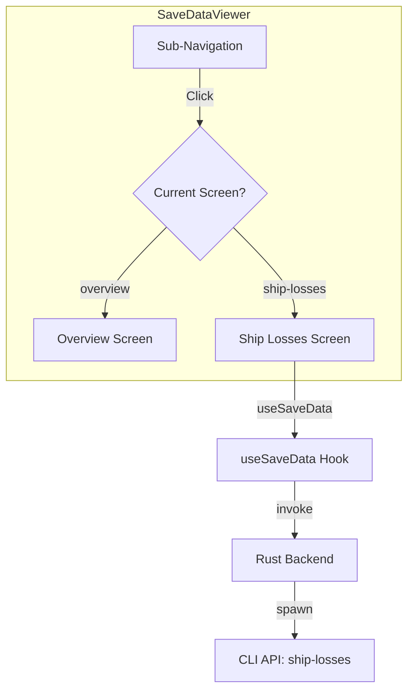

# Plan: Savegame Detail Screens & Ship Losses

This plan defines the navigation structure for savegame-specific details and the implementation of the Ship Losses view.

## 1. Navigation Architecture

To accommodate multiple detailed views (Ship Losses, Owned Ships, etc.), we will introduce a sub-navigation layer within the `SaveDataViewer` component.

### Proposed Layout (Master-Detail-SubDetail)
- **Primary Sidebar** (App-level): Home, Parser, Viewer, Settings.
- **Secondary Sidebar** (Viewer-level):
    - **Save Selector** (Currently implemented): Choose which save to view.
    - **Data Categories** (New):
        - 📊 Overview (Default)
        - 🛸 Ship Losses
        - 🚢 Owned Ships (Future)
        - 🏭 Stations (Future)
        - 📜 Logbook (Future)

## 2. Shared Components for Detail Screens

To ensure consistency and reduce code duplication, we will implement:

- **`DataViewHeader`**: Displays the title, record count, and refresh button.
- **`DataTable`**: A reusable, paginated table component.
- **`DataPagination`**: Standardized controls for navigating large datasets.

## 3. Ship Losses Implementation

### CLI Integration
- Command: `ship-losses`
- Fields: `time`, `timeFormatted`, `shipName`, `location`, `commander`, `destroyedBy`, `category`
- Base Filter: `reverse(sort_by([*], &time))` (Show most recent losses first)

### `ShipLossesView` Component
- [ ] Implement data fetching with pagination.
- [ ] Render a table with the following columns:
    - **Time**: User-friendly game time (`timeFormatted`).
    - **Ship Name**: Bold name of the lost ship.
    - **Location**: Sector/Zone where it happened.
    - **Destroyed By**: The attacker (if known).
- [ ] Add a "Category" filter (Combat vs. Accident).

## 4. UI/UX Refinements

- **Persistence**: Remember the active sub-tab when switching between saves.
- **Loading States**: Skeleton screens for the tables.
- **Empty States**: Friendly message if no ships were lost in that save.

## 5. Sequence Diagram

