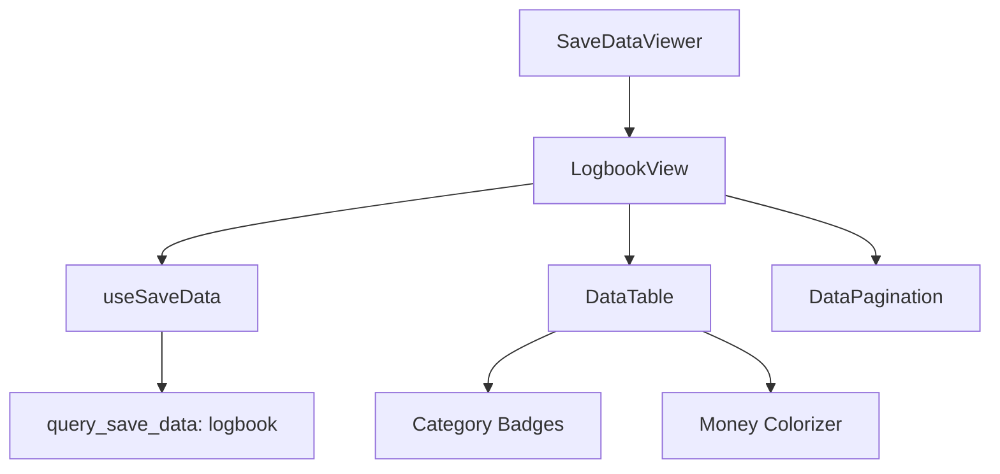

# Plan: Logbook Savegame Detail Screen

Implementation of the historical game event log view for extracted savegames.

## 1. Data Schema & API
- **Source API**: `query_save_data` with command `logbook`.
- **JMESPath Default Filter**: `reverse(sort_by([*], &time))` (Latest first).
- **Logbook Entry Schema**:
```typescript
interface LogbookEntry {
  time: number;           // Game time in seconds
  timeFormatted: string;  // User-friendly game time (e.g. 10d 04h 22m)
  category: string;       // Entry category (e.g., 'general', 'missions', 'alerts', 'upkeep')
  title: string;          // Short summary
  text: string;           // Detailed description
  money: number | null;   // Transaction amount (if applicable)
}
```

## 2. Component Design (`LogbookView.tsx`)
- Uses `DataTable` for event listing.
- Columns:
    - **Time**: `timeFormatted`
    - **Category**: `category` (with icon/color badge)
    - **Event**: `title`
    - **Description**: `text`
    - **Profit/Loss**: `money` (Formatted with currency, green for positive, red for negative)
- **Filters**:
    - Search by `title` or `text`.
    - Filter by `category`.
- **Pagination**: Standard `DataPagination`.

## 3. Integration Tasks
- [ ] Create `src/components/LogbookView.tsx`.
- [ ] Add translations to `src/locales/*.json`.
- [ ] Register `LogbookView` in `SaveDataViewer.tsx`.
- [ ] Enable the "Logbook" tab in the `SaveDataViewer` navigation.

## 4. UI/UX Refinement
- Implement category-specific badges:
    - `general`: Blue
    - `missions`: Purple
    - `alerts`: Red
    - `upkeep`: Orange
    - `tips`: Cyan
- Format `money` field:
    - `+1,234 Cr` (Green)
    - `-500 Cr` (Red)
    - Empty if null.


