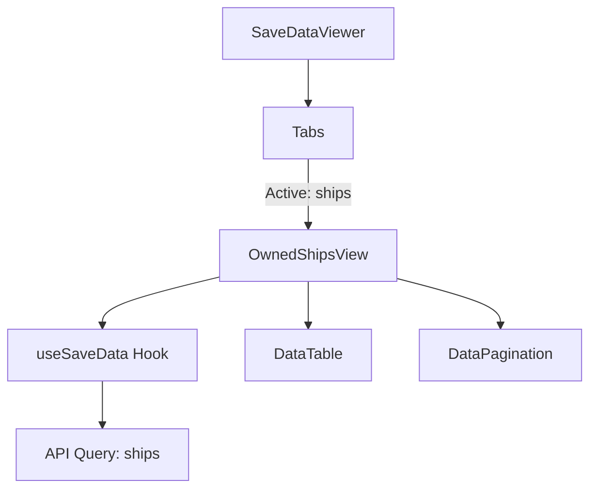

# Plan: Owned Ships Screen Implementation

This plan outlines the steps required to implement the "Owned Ships" screen in the X4 Savegame Parser Launcher. This screen will allow players to view a list of their owned ships with key details and basic filtering.

## 1. Prerequisites & Context
- **Command**: `ships` (using `query_save_data` Tauri command)
- **Filter**: `[?owner=='player']`
- **Data Schema**:
  ```typescript
  interface Ship {
    componentId: string;
    connectionId: string;
    name: string;
    faction: string;
    owner: string;
    sector: string;
    zone: string;
    class: string;        // e.g., "ship_arg_m_fighter_01_a"
    purpose: string;      // e.g., "combat", "trade", "mining"
    hull: number;
    shields: number;
    cargo: {
      capacity: number;
      used: number;
    };
  }
  ```

## 2. Technical Steps

### UI Components
- Create `src/components/OwnedShipsView.tsx` based on `ShipLossesView.tsx`.
- Implement a list/table view using `DataTable` and `DataPagination`.
- Add filters for Ship Purpose (Combat, Trade, Mining) and Ship Class (S, M, L, XL - though `class` field seems to contain internal IDs, we might need a regex or mapping).

### Integration
- Register `OwnedShipsView` in `src/components/SaveDataViewer.tsx`.
- Enable the "Owned Ships" tab in the navigation.

### Internationalization
- Update `src/locales/*.json` with new strings for the ships screen.

## 3. Implementation Plan

- [x] **Define Types**: Add `Ship` interface to `src/components/OwnedShipsView.tsx`.
- [x] **Create View Component**: Implement `OwnedShipsView` component with data fetching logic using `useSaveData`.
- [x] **Enhance Pagination**:
    - [x] Update `DataPagination.tsx` to include a "Jump to Page" input field.
    - [x] Make `DataPagination` sticky at the bottom of the container.
- [x] **Update Main Viewer**:
    - [x] Import `OwnedShipsView` in `src/components/SaveDataViewer.tsx`.
    - [x] Enable the `Owned Ships` tab (remove `disabled` prop and update `onClick`).
    - [x] Add `OwnedShipsView` to the conditional rendering block.
- [x] **Add Localization**:
    - [x] Add strings for "Owned Ships", "Hull", "Shields", "Cargo", "Purpose", "Class", "Sector" to `src/locales/en.json` (and other languages if possible).

## 4. UI Design Reference
The screen should follow the existing design language:
- Header with icon (`Ship` from `lucide-react`) and title.
- Filter buttons at the top right.
- `DataTable` for the main list.
- Progress bars or percentage indicators for Hull and Shields.
- Cargo usage indicator (e.g., "120/500").


